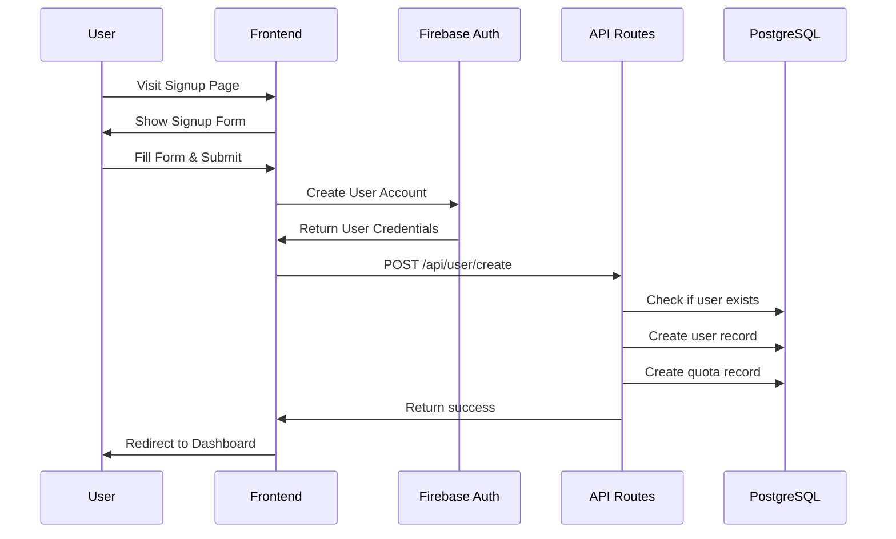
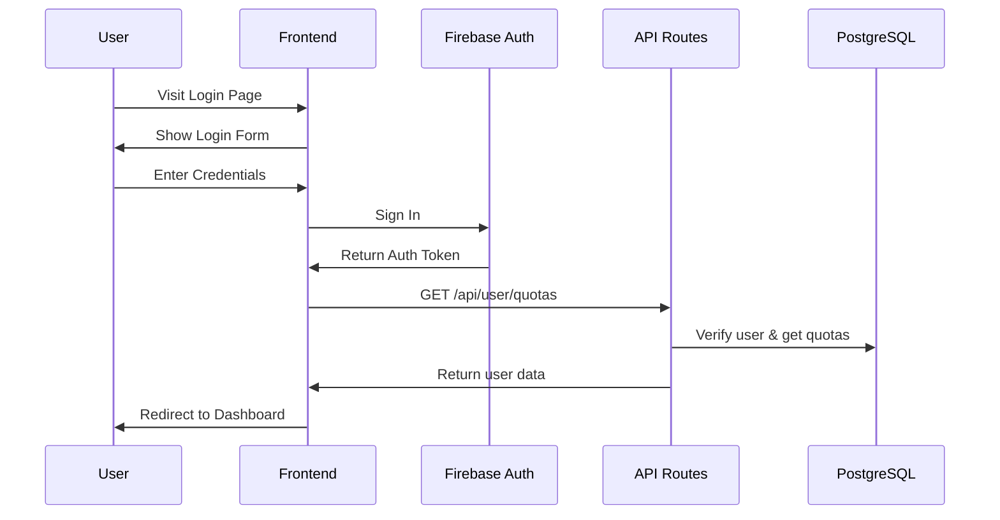
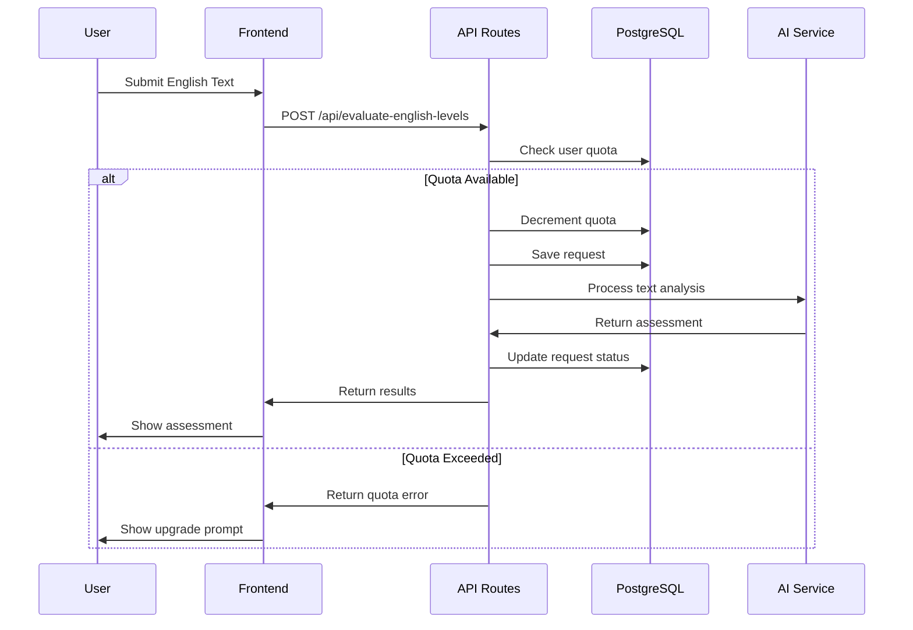
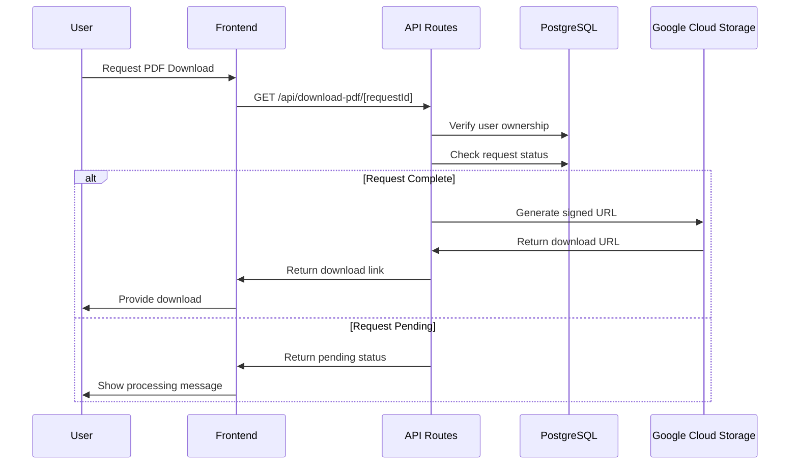
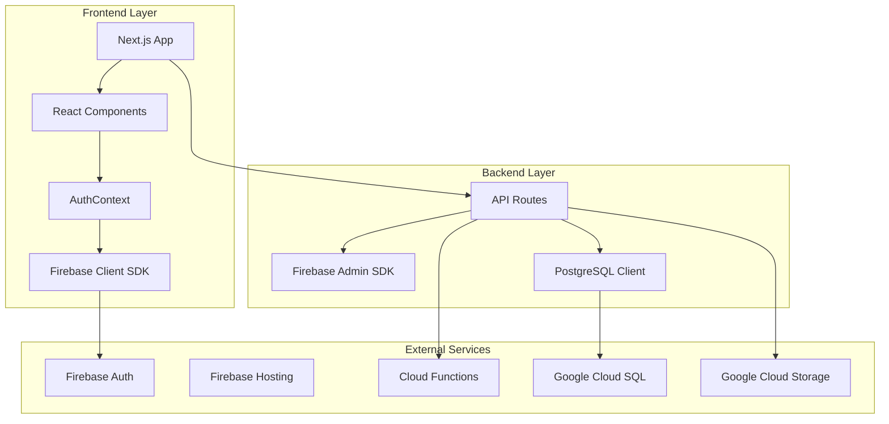
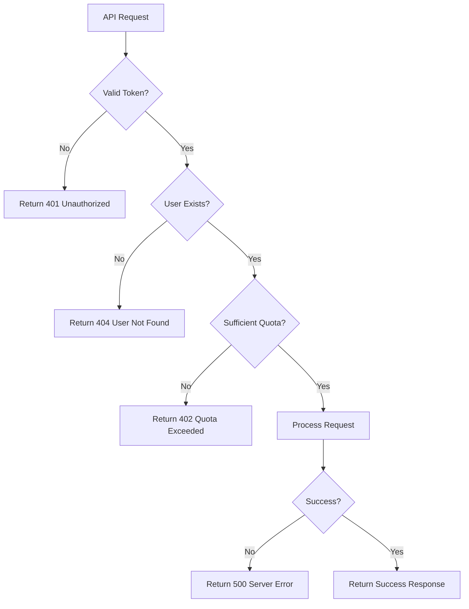
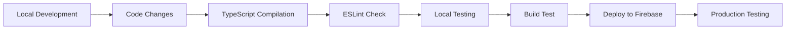

# Application Workflow Diagrams

## 1. User Registration & Onboarding Flow

## 2. User Authentication Flow

## 3. English Assessment Flow

## 4. PDF Download Flow

## 5. System Architecture Flow

## 6. Error Handling Flow

## 7. Development Workflow

## Key Integration Points

### 1. Firebase Integration
- **Client-Side**: Authentication, real-time updates
- **Server-Side**: Token verification, admin operations
- **Hosting**: Static file serving, serverless functions

### 2. Database Integration
- **Connection Pooling**: Efficient database connections
- **Transaction Management**: Data consistency
- **Query Optimization**: Fast response times

### 3. Security Integration
- **Token Verification**: Every API request
- **User Isolation**: Data access control
- **Input Validation**: XSS and injection prevention

## Performance Considerations

### 1. Frontend Optimization
- **Code Splitting**: Lazy load components
- **Image Optimization**: Next.js Image component
- **Caching**: Browser and CDN caching

### 2. Backend Optimization
- **Database Indexing**: Fast query execution
- **Connection Pooling**: Reuse database connections
- **Response Caching**: Cache frequently accessed data

### 3. Deployment Optimization
- **Static Generation**: Pre-render static pages
- **Serverless Functions**: Scale automatically
- **CDN Distribution**: Global content delivery
